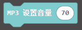

# MP3

MP3 - MP3 Module
---------------------------------------------------------

## Table of Contents

* [URL](#url)
* [Summary](#summary)
* [Blocks](#blocks)
* [License](#license)

## URL
project URL: ```https://github.com/emakefun/pxt-MP3```

## Blocks

### pin set


### play control


### play songs


### play mode


### volume control


### set the equalizer


### test link 
https://makecode.microbit.org/_buegDJ6HMMP4

## License

MIT

## Supported targets

* for PXT/microbit
(The metadata above is needed for package search.)
```package
MP3=github:emakefun/pxt-MP3
```
